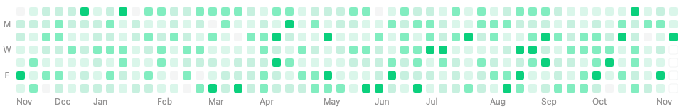

# Calendar Graph+

> Calendar graph plus library fork from [calendar-graph](https://github.com/d-band/calendar-graph)

[](https://www.npmjs.com/package/calendar-graph-plus)
[](https://www.npmjs.com/package/calendar-graph-plus)
[](https://greenkeeper.io/)

## Plus

- `monthsPosition` [String] now supports the option to position the months widget at the bottom of graph
- `styleOptions.background` [String] now allows for a custom background to be applied
- `showMonths` [Boolean] now allows the months widget to be hidden
- `customMonths` [Array<String>] now allows for custom months content to be displayed


## Install

```bash
$ yarn add calendar-graph-plus
```

## Usage

[View demo online](https://plus1byte.github.io/calendar-graph-plus/)

```javascript
import { SVGGraph, CanvasGraph, StrGraph } from 'calendar-graph-plus';

const data = [
  { date: '2016-01-01', count: 1 },
  { date: '2016-01-03', count: 4 },
  { date: '2016-01-06', count: 2 },
  // ...and so on
];

new SVGGraph('#svg-root', data, {
  showMonths: true,
  monthsPosition: 'bottom'
  customMonths: ['Jan', 'Feb', 'Mar', 'Apr', 'May', 'Jun', 'Jul', 'Aug', 'Sep', 'Oct', 'Nov', 'Dec'],
  startDate: new Date('2016-01-01'),
  endDate: new Date('2016-04-01'),
  styleOptions: {
    background: 'transparent'
  }
  colorFun: (v) => {
    return '#d6e685';
  }
});

new CanvasGraph('#canvas-root', data, {
  showMonths: true,
  monthsPosition: 'bottom'
  customMonths: ['Jan', 'Feb', 'Mar', 'Apr', 'May', 'Jun', 'Jul', 'Aug', 'Sep', 'Oct', 'Nov', 'Dec'],
  startDate: new Date('2016-01-01'),
  endDate: new Date('2016-04-01'),
  styleOptions: {
    background: 'transparent'
  }
  colorFun: (v) => {
    return '#d6e685';
  }
});

const strGraph = new StrGraph(data, {
  startDate: new Date('2016-01-01'),
  endDate: new Date('2016-04-01'),
  colorFun: (v) => {
    return '#d6e685';
  }
});
this.body = strGraph.render();
```



## Options

```javascript
{
  showMonths: true,
  monthsPosition: 'bottom',
  customMonths: [],
  onClick: v => {},
  colorFun: v => {},
  startDate: oneYearAgo,
  endDate: today,
  size: 12,
  space: 1,
  padX: 20,
  padY: 20,
  styleOptions: {
    background: 'transparent'
    textColor: '#959494',
    fontSize: '12px',
    fontFamily: '-apple-system, BlinkMacSystemFont, "Segoe UI", Roboto, "Helvetica Neue", Arial, sans-serif'
  }
}
```

## Report a issue

- [All issues](https://github.com/d-band/calendar-graph/issues)
- [New issue](https://github.com/d-band/calendar-graph/issues/new)

## License

Graph is available under the terms of the MIT License.
